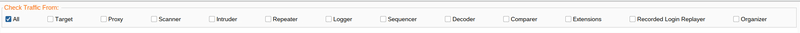
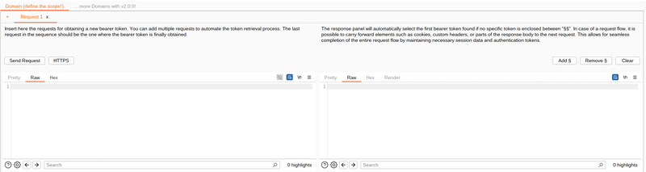
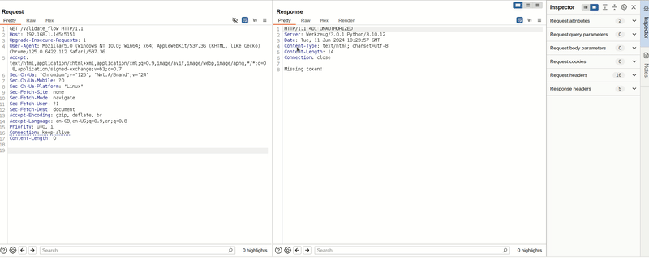
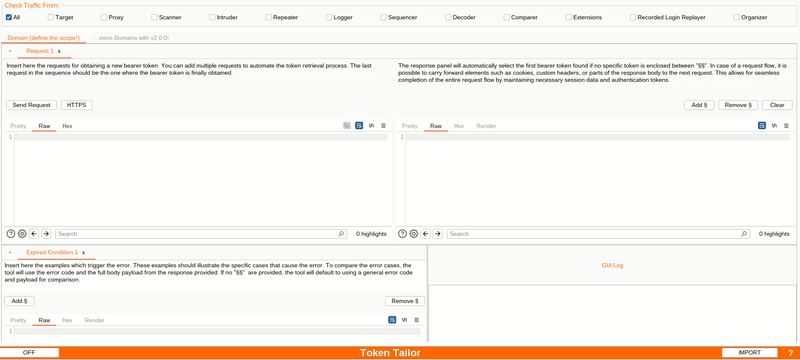

_If you find this Burp Extension useful, please consider giving it a star_ 🙏

---
# Token Tailor 

## About
Token Tailor is a Burp Suite Community Edition extension that aims to simplify security testing by automating authentication (JWT and Basic) renewal.

This extension eliminates the need for manual token extraction and updates, reducing scanning errors and streamlining your workflow.

Configure Token Tailor to handle session renewals for all traffic passing through Burp Suite, providing a "tailor-made" solution for efficient session management.

##  :building_construction: QuickStart

1. Install the extension from the BApp store or download the latest [release](https://github.com/forteBruno/Token-Tailor/releases) from this repository and install the provided JAR file (Extension tab > Extension file (.jar)).
2. In the `Request` tab, add an HTTP request that provides a JWT or Basic Session Token.
3. Click `Send` to execute the request. Ensure the host is within the defined scope.
4. In the `Exp` tab, add the response that the server returns when the session has expired. By default, only the HTTP status code and body of each response will be compared.
5. Click the toggle button at the bottom-left to activate the Token Tailor extension.

##  :outbox_tray: Set up with SQLMap or other tools!
This extension can intercept all traffic passing through Burp Suite.

If an external tool like [SQLMap](https://github.com/sqlmapproject/sqlmap) is configured with the "--proxy", that traffic can also be intercepted, preventing any unauthorized responses from being sent to the tool.

The extension will renew the Bearer or Basic token and resend the request with the correct authorization, ensuring the tool receives the appropriate response.

## :wrench: Features

### Check Traffic From: 

Select the tool(s) from which you want to check the traffic to identify expired conditions. Choose `All` to check all traffic through Burp or select specific tools.

### Requests Flow

This section allows for the definition of a flow to retrieve a Bearer or Basic token.
1. The request should be copied and pasted into the first tab.
   - More tabs can be added by clicking the `+` tab button to define a flow.
   - To include a header in the next request, define its content and enclose the desired value within `§` symbols. This process can be repeated for multiple headers. Token Tailor will automatically add the header to the next request if it doesn't exist or update the header's value if it does.
2. The final response must include a Bearer or Basic token. 
   - If the response contains a single token without `§` delimiters, it will be automatically parsed and used.
   - If multiple tokens are present, the desired token can be specified by enclosing it within `§` delimiters.
   - Otherwise, the first valid JWT or Basic token found in the response body, followed by any found in the headers, will be used.

All specified hosts must be within the target scope.

### Expired Condition

- Define one or more conditions that trigger upon session expiration. 
   - Without `§` delimiters, Token Tailor compares the response status code and body with the provided ones. If they match in any of each response from the selected tools, a new flow starts to get a new Bearer or Basic Token.
   - With `§` delimiters, Token Tailor compares the text between the delimiters in each response from the selected tools. If the text is found, a new request flow starts.

### Import / Export

When the button shows `ON`, the current configuration can be exported in order to reuse it in a new Burp session. 

:pushpin: It is recommended to export your Token Tailor settings before exiting Burp Suite. This ensures that your configurations are saved and can be easily re-imported when you restart the software

When the Token Tailor button at the bottom-left corner shows `OFF`, it is possible to click on the `Import` button at the bottom-right corner in order to import a JSON file with a valid configuration.

:no_entry_sign: Avoid manually editing the JSON file, as it contains credentials for a valid JWT or Basic session token.

### :new: Upcoming Features [Planned]:

- Support multiple session flow for different Domains 
- More Authentication Methods
- YouTube Channel with Practical Use Cases
- ... Share your ideas for new use cases!

## :question: F.A.Q.
***Does the extension intercept traffic from all tools?***

Yes, Token Tailor intercepts all traffic passing through or generated by Burp. It is highly recommended to use it with other tools like [SQLMap](https://github.com/sqlmapproject/sqlmap.git) to prevent session expiration from interrupting scans.

***It is possible to set up without use the BApp store?***

Yes, follow this steps:
1. Download the latest [release](https://github.com/forteBruno/Token-Tailor/releases) from this repository
2. In Burp, go to the Extension tab.
3. Click the `Add` button.
4. Select `Extension Type: Java`.
5. Select the JAR file by clicking the `Select file` button next to `Extension file (.jar)`.

## :mailbox: Contact

  

## Special Thanks:
- [Riccardo Cardelli](https://github.com/gand3lf)
